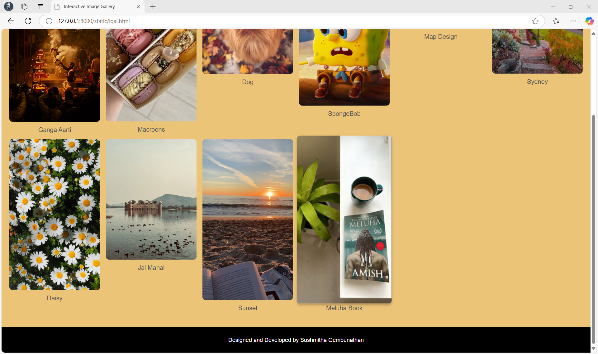

# Ex.08 Design of Interactive Image Gallery
## Date:14-12-24

## AIM:
To design a web application for an inteactive image gallery with minimum five images.

## DESIGN STEPS:

### Step 1:
Clone the github repository and create Django admin interface.

### Step 2:
Change settings.py file to allow request from all hosts.

### Step 3:
Use CSS for positioning and styling.

### Step 4:
Write JavaScript program for implementing interactivity.

### Step 5:
Validate the HTML and CSS code.

### Step 6:
Publish the website in the given URL.

## PROGRAM :
```
igal.html

<!DOCTYPE html>
<html lang="en">
<head>
  <meta charset="UTF-8">
  <meta name="viewport" content="width=device-width, initial-scale=1.0">
  <title>Interactive Image Gallery</title>
  <link rel="stylesheet" href="igalcss.css">
</head>
<body>
  
  <!-- Gallery Heading -->
  <h1 class="gallery-heading">Interactive Image Gallery</h1>

  <!-- Image Gallery -->
  <div class="gallery">
    <div class="gallery-item">
      
      <div class="image-name">Ganga Aarti</div>
    </div>
    <div class="gallery-item">
      
      <div class="image-name">Macroons</div>
    </div>
    <div class="gallery-item">
      
      <div class="image-name">Dog</div>
    </div>
    <div class="gallery-item">
      
      <div class="image-name">SpongeBob</div>
    </div>
    <div class="gallery-item">
      
      <div class="image-name">Map Design</div>
    </div>
    <div class="gallery-item">
      
      <div class="image-name">Sydney</div>
    </div>
    <div class="gallery-item">
      
      <div class="image-name">Daisy</div>
    </div>
    <div class="gallery-item">
      
      <div class="image-name">Jal Mahal</div>
    </div>
    <div class="gallery-item">
      
      <div class="image-name">Sunset</div>
    </div>
    <div class="gallery-item">
      
      <div class="image-name">Meluha Book</div>
    </div>
  </div>

  <!-- Modal for Enlarged Image -->
  <div id="modal" class="modal" role="dialog" aria-hidden="true">
    <span class="close-btn" onclick="closeModal()" tabindex="0" aria-label="Close modal">&times;</span>
    
  </div>
  <footer style="text-align: center; margin-top: 20px; padding: 10px; background-color: #000000; color: #ffffff; font-size: 0.9rem;">
    <p>Designed and Developed by Sushmitha Gembunathan</p>
  </footer>
  <script src="igaljs.js"></script>
</body>
</html>

igalcss.css 

body {
  font-family: Arial, sans-serif;
  margin: 0;
  padding: 0;
  background-color: #ebc478;
  color: #333;
}

.gallery-heading {
  text-align: center;
  margin: 20px 0;
  font-size: 2.5rem;
  color: #204764;
}

.gallery {
  display: grid;
  grid-template-columns: repeat(auto-fit, minmax(200px, 1fr));
  gap: 15px;
  padding: 20px;
}

.gallery-item {
  position: relative;
  cursor: pointer;
}

.gallery-img {
  width: 100%;
  height: auto;
  border-radius: 8px;
  transition: transform 0.3s, box-shadow 0.3s;
}

.gallery-img:hover,
.gallery-img:focus {
  transform: scale(1.05);
  box-shadow: 0 4px 8px rgba(0, 0, 0, 0.3);
  outline: none;
}

.image-name {
  text-align: center;
  margin-top: 8px;
  font-size: 1rem;
  color: #555;
}

.modal {
  display: none;
  position: fixed;
  top: 0;
  left: 0;
  width: 100%;
  height: 100%;
  background-color: rgba(0, 0, 0, 0.8);
  justify-content: center;
  align-items: center;
  z-index: 1000;
}

.modal img {
  max-width: 90%;
  max-height: 80%;
  border-radius: 8px;
}

.modal .close-btn {
  position: absolute;
  top: 20px;
  right: 20px;
  font-size: 2rem;
  color: #fff;
  cursor: pointer;
}

.modal .close-btn:hover {
  color: #ccc;
}

igaljs.js

// Get all gallery images and the modal elements
const galleryImages = document.querySelectorAll('.gallery-img');
const modal = document.getElementById('modal');
const modalImg = document.getElementById('modal-img');
const closeBtn = document.querySelector('.close-btn');

// Add click event listener for each gallery image
galleryImages.forEach(image => {
  image.addEventListener('click', () => {
    modal.style.display = 'flex';
    modal.setAttribute('aria-hidden', 'false');
    modalImg.src = image.src;
    modalImg.alt = image.alt;
  });
});

// Close the modal when the close button is clicked
closeBtn.addEventListener('click', closeModal);

// Close the modal when the Escape key is pressed
document.addEventListener('keydown', (event) => {
  if (event.key === 'Escape' && modal.style.display === 'flex') {
    closeModal();
  }
});

// Close modal function
function closeModal() {
  modal.style.display = 'none';
  modal.setAttribute('aria-hidden', 'true');
  modalImg.src = '';
  modalImg.alt = '';
}

```
## OUTPUT:




## RESULT:
The program for designing an interactive image gallery using HTML, CSS and JavaScript is executed successfully.
